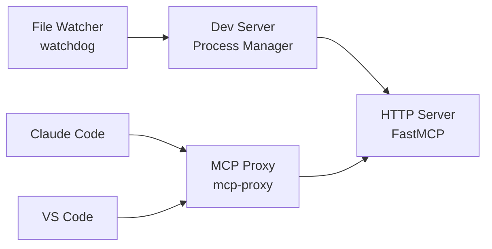

# Hot Reload Development Setup

This guide explains how to set up hot reload development for the Shared Context MCP Server and connect it to various MCP clients.

## Overview

The development setup provides:
- ✅ **True Hot Reload**: Automatic server restart on file changes
- ✅ **File Watching**: Monitors all Python files in `src/shared_context_server/`
- ✅ **Fast Restart**: Typically restarts in 1-2 seconds
- ✅ **Connection Stability**: MCP clients maintain connection through restarts
- ✅ **Clean Logging**: Clear indication of file changes and restart status
- ✅ **Log Rotation**: Automatic 10MB max size with 5 backup files to prevent disk space issues

## Quick Start

### 1. Start Development Server

```bash
# Start hot reload development server
uv run python -m shared_context_server.scripts.dev
```

You should see output like:
```
🔥 Hot reload enabled - server will restart on file changes
📁 Watching directory: /path/to/src/shared_context_server
🚀 Server started with PID 12345
```

### 2. Configure Claude Code

```bash
# Add server to Claude Code configuration
claude mcp add-json shared-context-server '{"command": "mcp-proxy", "args": ["--transport=streamablehttp", "http://localhost:23456/mcp/"]}'

# Verify connection
claude mcp list
```

### 3. Test Hot Reload

1. Make any change to a Python file in `src/shared_context_server/`
2. Save the file
3. Watch the logs show automatic restart:
   ```
   🔄 File changed: /path/to/file.py
   ♻️  Restarting server...
   🚀 Server started with PID 12346
   ```

## Architecture

### Components



### How It Works

1. **File Watcher**: `watchdog` monitors `src/shared_context_server/` recursively
2. **Debouncing**: 1-second debounce prevents excessive restarts
3. **Process Management**: Old server terminated, new server spawned
4. **Connection Bridging**: `mcp-proxy` maintains client connection during restart
5. **Transport Translation**: Converts between Streamable HTTP ↔ STDIO

## MCP Client Connections

### Claude Code (Recommended)

Claude Code provides the best development experience with integrated MCP support.

```bash
# Install mcp-proxy (required for HTTP transport bridge)
uv tool install mcp-proxy

# Add server configuration
claude mcp add-json shared-context-server '{
  "command": "mcp-proxy",
  "args": ["--transport=streamablehttp", "http://localhost:8000/mcp/"]
}'

# Verify connection
claude mcp list
# Should show: shared-context-server: ... - ✓ Connected

# Test tools
claude mcp tools shared-context-server
```

**Usage Example:**
```bash
# In Claude Code session
@shared-context-server create_session purpose="Development testing"
@shared-context-server add_message session_id="..." content="Test message"
```

### VS Code with MCP Extension

1. **Install MCP Extension**: Search for "MCP" in VS Code extensions
2. **Configure Server**: Add to VS Code settings.json:

```json
{
  "mcp.servers": {
    "shared-context-server": {
      "command": "mcp-proxy",
      "args": ["--transport=streamablehttp", "http://localhost:8000/mcp/"]
    }
  }
}
```

3. **Restart VS Code**: Reload window to pick up configuration
4. **Verify Connection**: Check MCP status in VS Code status bar

### Direct HTTP Testing

For testing without MCP clients:

```bash
# Test server health
curl http://localhost:8000/mcp/

# Test with mcp-proxy directly
echo '{"jsonrpc": "2.0", "id": 1, "method": "tools/list"}' | \
  mcp-proxy --transport=streamablehttp http://localhost:8000/mcp/
```

## Configuration

### Environment Variables

```bash
# Required
MCP_TRANSPORT=http              # Use HTTP transport
HTTP_PORT=8000                  # Server port (default: 8000)

# Optional
HTTP_HOST=localhost             # Server host (default: localhost)
MCP_SERVER_NAME=custom-name     # Server name (default: shared-context-server)
MCP_SERVER_VERSION=1.0.0        # Server version
DATABASE_PATH=./dev.db          # Database path
API_KEY=dev-key-123            # API key for development
LOG_LEVEL=DEBUG                 # Logging level
```

### Development Server Options

```bash
# Start with custom configuration
uv run python -m shared_context_server.scripts.dev --help

# Validate environment
uv run python -m shared_context_server.scripts.dev --validate

# Show server info
uv run python -m shared_context_server.scripts.dev --info

# Use custom config file
uv run python -m shared_context_server.scripts.dev --config-file .env.dev
```

## Troubleshooting

### Common Issues

#### Server Won't Start
```bash
# Check if port is in use
lsof -i :8000

# Kill existing processes
pkill -f "shared_context_server"

# Start with different port
HTTP_PORT=8001 uv run python -m shared_context_server.scripts.dev
```

#### MCP Connection Failed
```bash
# Verify mcp-proxy is installed
which mcp-proxy

# Install if missing
uv tool install mcp-proxy

# Test direct connection
curl http://localhost:8000/mcp/
```

#### Hot Reload Not Working
```bash
# Check file watcher permissions
ls -la src/shared_context_server/

# Verify watchdog installation
uv pip list | grep watchdog

# Check logs for file change events
# Look for: "🔄 File changed: ..." messages
```

### Debug Mode

```bash
# Enable debug logging
LOG_LEVEL=DEBUG uv run python -m shared_context_server.scripts.dev

# Check detailed logs
tail -f logs/development.log  # if configured
```

### Performance Tips

1. **Exclude Large Directories**: Hot reload only watches Python files in `src/`
2. **Database Location**: Use separate dev database to avoid conflicts
3. **Port Selection**: Use non-standard ports to avoid conflicts
4. **Memory Usage**: Server restart is lightweight (~1-2 seconds)

## Best Practices

### Development Workflow

1. **Start Dev Server**: `uv run python -m shared_context_server.scripts.dev`
2. **Configure Client**: Use Claude Code for best experience
3. **Make Changes**: Edit files in `src/shared_context_server/`
4. **Auto Restart**: Server restarts automatically on save
5. **Test Changes**: Client connection persists through restart

### Code Quality

```bash
# Run before committing
uv run ruff check          # Linting
uv run mypy src/          # Type checking
uv run pytest tests/     # Test suite
```

### Database Management

```bash
# Use separate dev database
export DATABASE_PATH="./dev_chat_history.db"

# Reset database on restart (optional)
export DEV_RESET_DATABASE_ON_START=true

# Backup important data
cp chat_history.db chat_history.backup.db
```

## Integration Examples

### Claude Code Integration

```python
# In your Claude Code session, you can:
# 1. Create sessions for organizing conversations
# 2. Store context that persists across agent interactions
# 3. Search and retrieve relevant information
# 4. Manage agent memory and state

# Example workflow:
session_id = create_session("Multi-agent coordination")
add_message(session_id, "Planning phase complete")
search_context(session_id, "planning")
```

### VS Code Integration

```typescript
// In VS Code extension or script
import { MCPClient } from 'mcp-sdk';

const client = new MCPClient({
  serverName: 'shared-context-server',
  transport: 'proxy'
});

// Use server tools
const session = await client.callTool('create_session', {
  purpose: 'Code review session'
});
```

## Next Steps

1. **Explore Tools**: Use `claude mcp tools shared-context-server` to see available tools
2. **Test Features**: Try session management, message storage, and search
3. **Build Integrations**: Create custom workflows using the MCP tools
4. **Monitor Performance**: Watch logs for optimization opportunities
5. **Scale Up**: Move to production setup when ready

For production deployment, see [Production Setup Guide](./production-setup.md).
